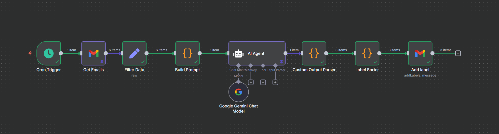
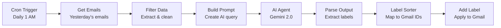

# 📧 AI-Powered Email Label Mapper for Job Search


*Automated email categorization workflow powered by AI*

## Overview

An intelligent n8n workflow that automatically categorizes job-search related emails using Google Gemini AI. The workflow runs daily, analyzes your inbox, and applies appropriate Gmail labels to organize your job applications, interviews, assessments, and more.

### Features

- **AI-Powered Classification** - Uses Google Gemini 2.0 Flash to intelligently categorize emails
- **Automated Daily Runs** - Cron trigger processes yesterday's emails at 1 AM
- **Smart Labeling** - Automatically applies Gmail labels based on email content
- **Privacy-Focused** - Only sends minimal email data (subject, sender, 350 chars of body)
- **Job Search Focused** - Filters out promotional emails, focuses on relevant career communications


## Email Categories

The workflow categorizes emails into **6 labels**:

| Label | Description |
|-------|-------------|
| 📝 **Applied** | Application confirmations and thank you messages |
| 💼 **Interviews and Offers** | Interview invitations and job/internship offers |
| 📊 **OAs** | Online Assessment and Technical Assessment notifications |
| 👔 **Recruiters** | Messages from recruiters (non-promotional) |
| 🤝 **Referrals** | Job referral notifications |
| ❌ **Rejections** | Application rejections or "no longer considered" emails |


## 🛠️ Setup Instructions

### Prerequisites

1. **n8n Instance** - Self-hosted or cloud ([n8n.io](https://n8n.io))
2. **Gmail Account** with OAuth2 configured
3. **Google Gemini API Key** ([AI Studio](https://aistudio.google.com/app/apikey))

### Installation Steps

#### 1. Clone & Import Workflow

```bash
git clone https://github.com/YashPatel04/AI-Email-Sort.git
cd AI-Email-Sort
```

- Open n8n
- Click **"Import from File"**
- Select `Email-Label-Mapper.json`

#### 2. Configure Credentials

##### Gmail OAuth2

1. Go to n8n **Credentials** → **Add Credential** → **Gmail OAuth2**
2. Follow the OAuth2 setup wizard
3. Note the credential ID

##### Google Gemini API

1. Get your API key from [Google AI Studio](https://aistudio.google.com/app/apikey)
2. Go to n8n **Credentials** → **Add Credential** → **Google PaLM API**
3. Enter your API key
4. Note the credential ID

#### 3. Update Workflow Nodes

Replace placeholder credential IDs in these nodes:

**Get Emails Node:**
```json
"credentials": {
  "gmailOAuth2": {
    "id": "YOUR_ACTUAL_GMAIL_CREDENTIAL_ID"
  }
}
```

**Google Gemini Chat Model Node:**
```json
"credentials": {
  "googlePalmApi": {
    "id": "YOUR_ACTUAL_GEMINI_CREDENTIAL_ID"
  }
}
```

**Add Label Node:**
```json
"credentials": {
  "gmailOAuth2": {
    "id": "YOUR_ACTUAL_GMAIL_CREDENTIAL_ID"
  }
}
```

#### 4. Create Gmail Labels

Create these labels in Gmail:
- Applied
- Interviews and Offers
- OAs
- Recruiters
- Referrals
- Rejections

#### 5. Get Gmail Label IDs

Run one of the following methods to obtain your Gmail label IDs and paste them into the Label Sorter node:

- Using the Gmail API Explorer: open the Gmail API "users.labels.list" method, authorize with your account, execute the request, and copy the "id" values for the labels you created.
- In n8n: add a temporary Gmail node using the "Get All Labels" operation, run the node, and copy each label's ID from the node output.
- Via script: call the Gmail API's users.labels.list endpoint (authenticated with OAuth2) and extract the "id" fields from the JSON response.

After collecting the IDs, update the **Label Sorter** node mapping (replace the placeholder names with the actual label IDs).

Update the **Label Sorter** node:
```javascript
switch ($json["labelId"]) {
    case 0:
        labelName = "Label_YOUR_APPLIED_LABEL_ID";
        break;
    case 1:
        labelName = "Label_YOUR_INTERVIEWS_LABEL_ID";
        break;
    // ... update all 6 cases
}
```

#### 6. Activate Workflow

- Click **Active** toggle in n8n
- The workflow will run daily at 1:00 AM


## How It Works



### Workflow Nodes Explained

1. **Cron Trigger** - Runs daily at 1:00 AM
2. **Get Emails** - Fetches yesterday's emails from Gmail
3. **Filter Data** - Extracts subject, sender, and first 350 characters of body
4. **Build Prompt** - Creates structured prompt for AI with label definitions
5. **AI Agent** - Sends to Google Gemini for classification
6. **Custom Output Parser** - Parses AI response and extracts label assignments
7. **Label Sorter** - Maps numeric label IDs to Gmail label identifiers
8. **Add Label** - Applies the appropriate Gmail label


## AI Prompt

Use the following prompt when sending emails to the AI model. The workflow sends each email as a small JSON object (only the fields below).

```text
YOU ARE AN EMAIL SORTING EXPERT. YOU WILL BE GIVEN EMAILS IN JSON FORMAT WITH FIELDS:
- email_id (Gmail message ID)
- subject (email subject)
- from (sender's email)
- body (first 350 characters of the email body)

ANALYZE EACH EMAIL FOR ITS RELEVANCE TO JOB SEARCH. ADD A LABEL BASED ON THE FOLLOWING CATEGORIES. IF THE EMAIL IS NOT JOB-RELATED (PROMOTIONAL/GENERAL EMAIL), SKIP IT.

LABELS:
[
  {"label": "Applied", "id": 0, "summary": "Application confirmation or thanks."},
  {"label": "Interviews and Offers", "id": 1, "summary": "Indicates an upcoming interview or job/internship offer."},
  {"label": "OAs", "id": 2, "summary": "Notifies user about an Online/Technical Assessment."},
  {"label": "Recruiters", "id": 3, "summary": "Sent by a recruiter and NOT a promotion."},
  {"label": "Referrals", "id": 4, "summary": "User was referred for a job."},
  {"label": "Rejections", "id": 5, "summary": "User was rejected or not considered anymore."}
]

REPLY FORMAT (STRICT):
Return only **relevant emails** as JSON array of objects with fields:
- email_id
- label_id

EXAMPLE:
[
  {"email_id": "1789a1b2c3d4e5f6", "label_id": 0}
]

here are the emails:
```

## Security & Privacy

✅ **No credential leaks** - Uses n8n's encrypted credential store  
✅ **Minimal data exposure** - Only 350 characters of email body sent to AI  
✅ **OAuth2 authentication** - No passwords stored  
✅ **Local processing** - Runs on your n8n instance  

### Data Sent to Google Gemini

```json
{
  "email_id": "gmail_message_id",
  "subject": "Email subject line",
  "from": "sender@example.com",
  "body": "First 350 characters..."
}
```


## Configuration Options

### Adjust Processing Time

Edit the **Cron Trigger** node to change schedule:
```json
"triggerAtHour": 1  // Change to desired hour (0-23)
```

### Change Email Body Length

Edit the **Filter Data** node:
```javascript
body: text.slice(0, 350)  // Change 350 to desired length
```

### Modify AI Model

Edit the **Google Gemini Chat Model** node:
```json
"modelName": "models/gemini-2.0-flash-001"
// Options: gemini-pro, gemini-2.0-flash-001, etc.
```


## Troubleshooting

### Emails Not Being Labeled

1. Check if Gmail labels exist
2. Verify label IDs in **Label Sorter** node
3. Check workflow execution logs in n8n

### API Rate Limits

- Gmail: 250 quota units per user per second
- Gemini: Depends on your API tier
- Consider adding a **Split In Batches** node for large volumes

### Incorrect Classifications

- Adjust the AI prompt in **Build Prompt** node
- Add more context or examples to the prompt
- Try a different Gemini model (e.g., gemini-pro)


## Performance

- **Processing Speed**: ~2-3 seconds per email
- **Daily Capacity**: Handles 100+ emails per run
- **Accuracy**: ~90% correct classification (AI-dependent)


## Contributing
Contributions are welcome! Please:
1. Fork the repository
2. Create a feature branch
3. Test your changes
4. Submit a pull request


## License

MIT License - see [LICENSE](LICENSE) file for details

## Support

- Issues: [GitHub Issues](https://github.com/YashPatel04/AI-Email-Sort/issues)
- n8n Docs: [docs.n8n.io](https://docs.n8n.io)

## Tech Stack
- [n8n](https://n8n.io) - Workflow automation platform
- [Google Gemini](https://ai.google.dev) - AI classification model
- [Gmail API](https://developers.google.com/gmail/api) - Email integration
<p align="center">
  
  
  
</p>

